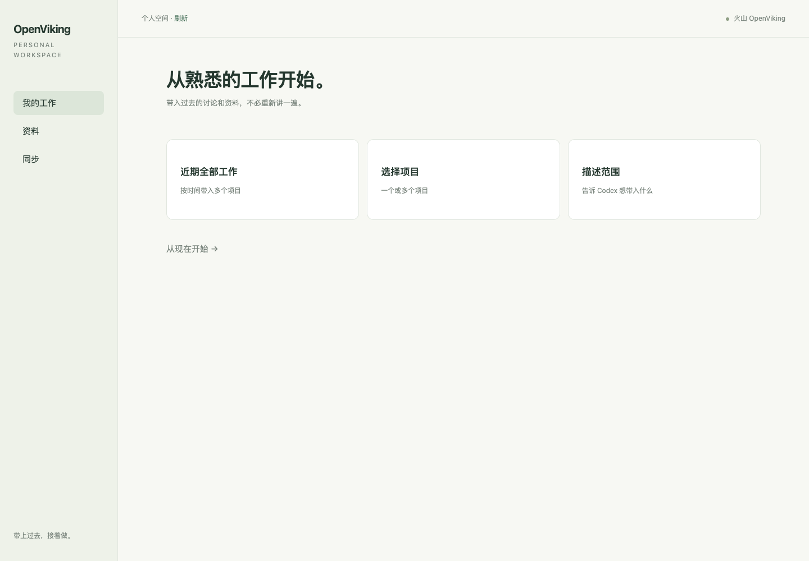

# OpenViking Developer Codex App

从火山控制台复制接入指令，让 Codex 带入已有工作，再接着做。

本仓库是个人版交互层。自动记忆复用官方 `openviking-memory` 插件，连接火山商业化服务；不内置官方运行时、不重复注册 Hook、不安装开源服务端。

## 用户入口

控制台填入 API Key 后输出 [接入指令](docs/console-connect.md)，用户粘贴给 Codex。Agent 安装并验证后打开工作台。

工作台支持：近期 7/30/90 天的全部工作、多项目、自然语言范围；个人资料浏览；带来源的工作进展与下一步。选范围仅保存选择，由 Codex 核对清单后执行。工作卡片通过复制指令接回 Codex。

## 如何尝试

### 先打开工作台

已有火山连接时，可以直接运行，不必先重装官方插件：

```bash
python3 plugins/ov-personal/scripts/panel.py start
```

打开命令返回的本机地址即可。页面复用 `~/.openviking/ovcli.conf`；未配置时会显示接入入口。该命令不安装插件、不上传历史；浏览资料会使用已有连接读取个人空间。选择范围只保存在本机，回到 Codex 核对清单后才导入。

### 走完整 onboarding

在 Codex 中打开本仓库，将 [接入指令](docs/console-connect.md) 的 API Key 占位符替换后粘贴给 Codex。也可以在已有正确连接时直接发送：

> 请按这个仓库的 docs/console-connect.md 为我接入火山 OpenViking。复用已有火山连接，先核对官方插件版本，再完成安装验证并打开工作台；历史范围由我选择。

安装路径会重新注册锁定版本的官方插件；仅看界面时使用上面的 panel 命令即可。运行 `python3 install.py --plan` 可以先查看安装目标，不会执行安装。需要 Hook 信任或新任务加载时，按 Codex 的实际提示继续。

从另一台机器获取私有仓库：

```bash
gh repo clone zhangxiaoyan1081/openviking-developer-codex-app
cd openviking-developer-codex-app
python3 install.py --plan
```

仓库与本地项目名称使用 `openviking-developer-codex-app`；内部插件 ID 暂保留 `ov-personal`，避免让命名调整影响安装与状态路径。

## 官方依赖

`upstream.lock.json` 固定官方 GitHub commit `eb2acdb8b632c83392a10625f39d444f26c3cd09`，官方插件声明版本 0.9.3。安装器下载该 commit 的官方脚本、核对 SHA256，再以同一 commit 注册官方 GitHub marketplace。服务端固定为 `https://api.vikingdb.cn-beijing.volces.com/openviking`，GitHub 是插件分发源，不是开源服务端部署流程。

安装需要 Python 3.10+、Node.js 22+、Git、Codex CLI 和可访问的 GitHub。先查看 `python3 install.py --plan`；实际安装读取官方 `~/.openviking/ovcli.conf`，或用 `--configure-stdin` 提供凭据。不会在开发和测试过程中自动安装到当前用户环境。

若已注册同名官方 marketplace，官方安装脚本会重新注册固定版本。切换前检查原版本及其他项目影响；用户明确接入授权不等于可以悄悄切换不同账号。环境变量覆盖和非 default 用户目前会显式停止，避免两个插件使用不同身份。

## 目录

- `plugins/ov-personal/skills/ov-personal`：对话编排、范围、导入、Working Memory 和接续。
- `scripts/cloud.py`：仅火山的共享凭据与个人资源读取。
- `scripts/history.py`：获准导出计划的分批导入、commit、状态和概览读取；本机游标防重复和未知请求保护。
- `scripts/workspace.py`：带来源工作卡片发布。
- `scripts/panel.py`、`assets/index.html`：仅本机的个人工作台。

首次只读复用已有内容；批量导入按服务端权限执行，MCP 是否直接暴露写 Session 工具不影响 HTTP 适配。资料正文继续使用官方工具保存并读回。私有数据在 `~/.openviking/personal/`，按连接身份隔离，不在仓库中。

## 验证边界

这是首版实现，不是完成火山端到端验收的发布版。单元测试使用模拟服务响应；还需真实商业化实例验证 Session 批量接口、commit/task、归档概览、独立新会话与桌面 Hook。未提供真实 key，因此没有对用户历史进行上传。

历史来源由当前 Agent 使用宿主支持的任务工具或用户导出提供；不扫描私有宿主数据库。无法枚举的历史会明确标注，不保证任意环境完整三个月。活跃会话不批量重放，已被官方捕获的会话复用。响应不确定时停止，不盲目重试；自动冲突修复暂未实现。

没有 Computer History、团队看板、日报调度和 MCP Apps。个人版首版聚焦上下文初始化与接续，网页交互可直接使用；MCP 卡片可后续接入同一数据模型。

## 本地检查

```bash
python3 -m unittest discover -s tests -v
node tests/check_ui.cjs
python3 install.py --plan
```

## 来源

产品原型参考同事的 `ov-distributable`（Lingyu OpenVikingViewer / local Codex integration）。本仓库为独立个人版交互实现，未携带原型的旧 memory-runtime 或打包第三方 JS。官方插件通过官方仓库安装，许可证以其上游为准。本仓库暂为私有协作项目，未另行授予开源许可。

## 页面预览

以下使用模拟连接状态进行浏览器交互验证，不代表实际云端连接验收。



已验证桌面首页、90 天范围选择、复制交接、同步页及移动端布局；模拟数据未上传 OV。
