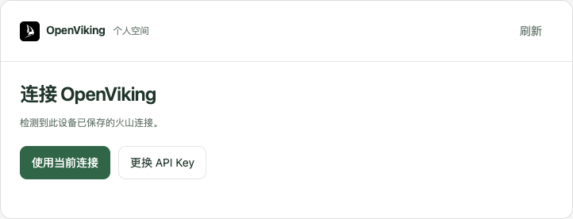
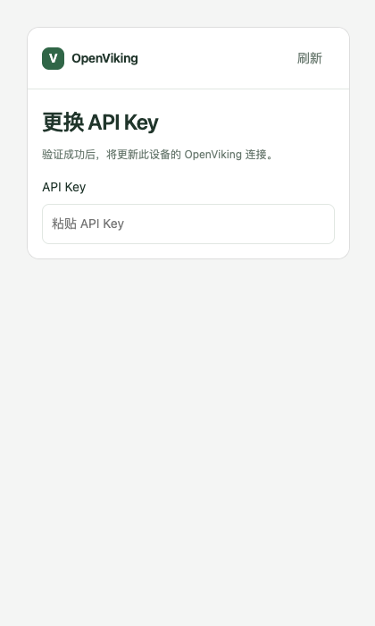
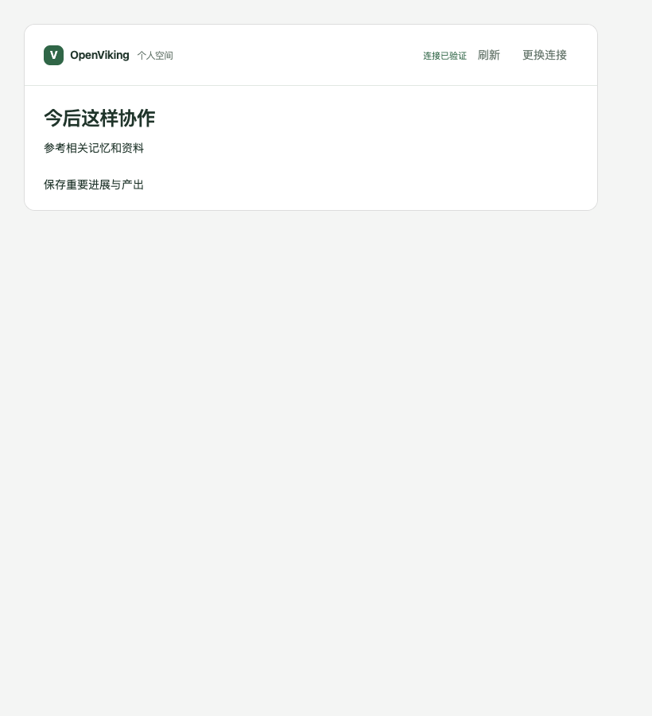
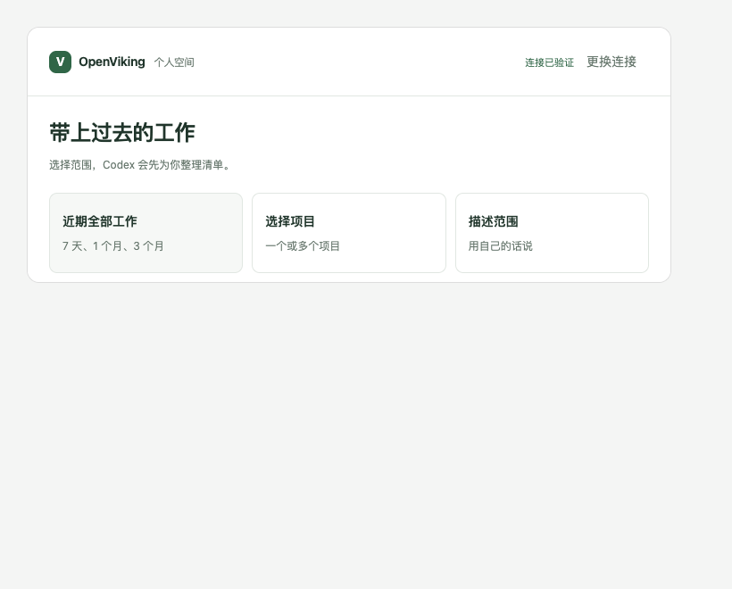
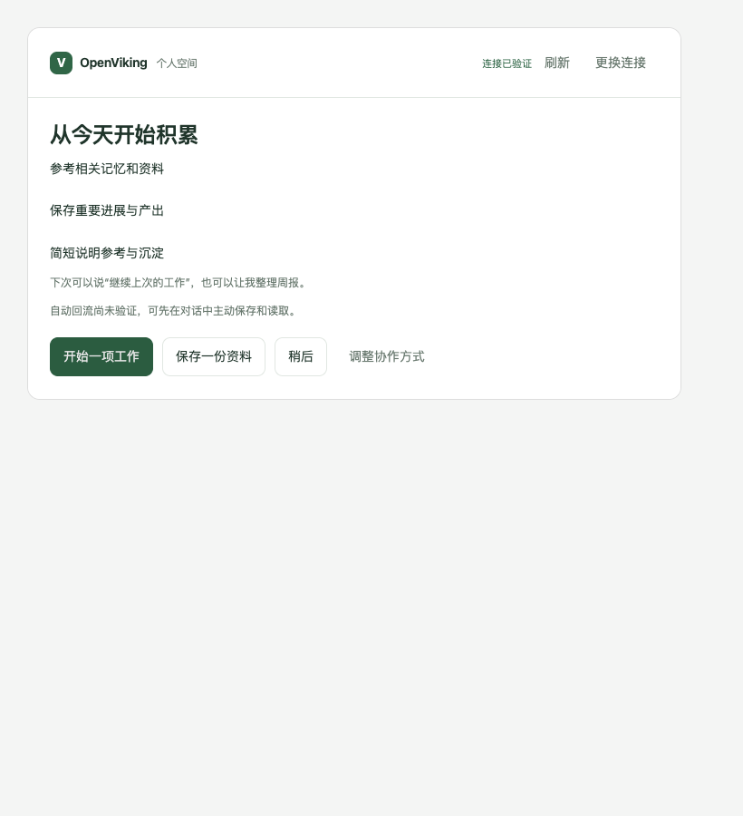
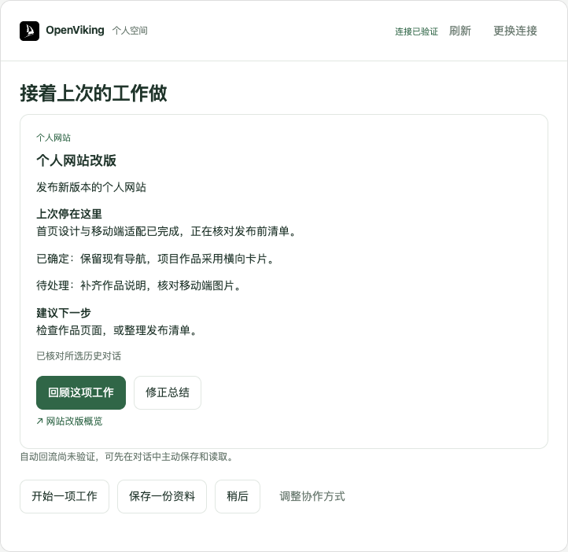
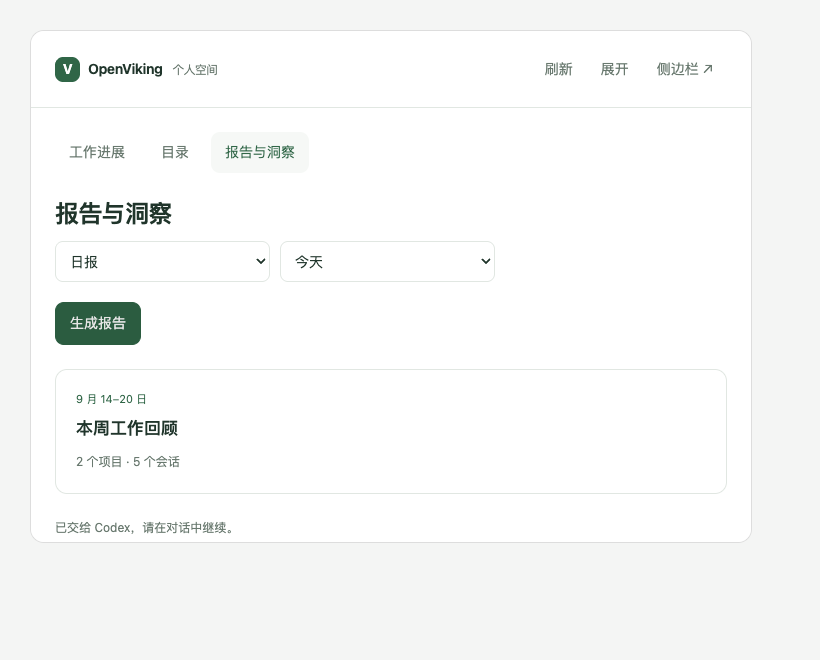
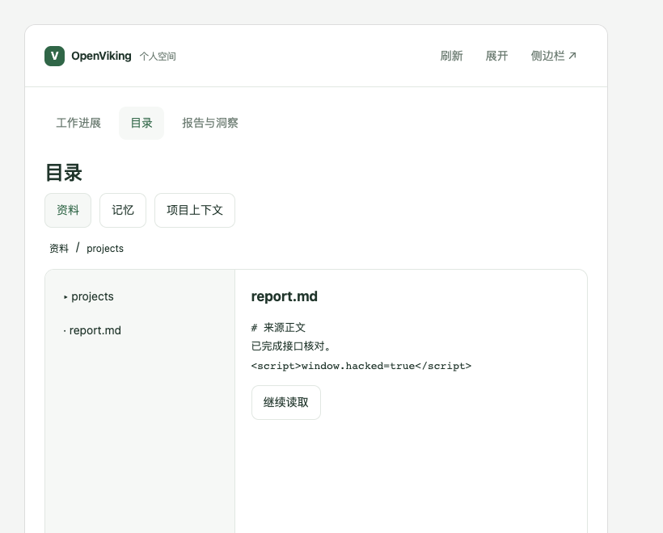

# OpenViking Developer Codex App

在 Codex 对话中接入火山 OpenViking，带入已有工作，再接着做。

插件名：`openviking-codex-app`。个人版交互插件；自动记忆复用官方 `openviking-memory`。服务端仅连接火山商业化实例。本版不识别 key 对应的版本、不提供企业分流。

## 体验路径

1. 用户粘贴控制台生成的 [接入指令](docs/console-connect.md)。指令含 Key 时，Codex 验证后继续；没有提供 Key 时，先显示连接卡片，选择“使用当前连接 / 更换 API Key”或填写新 Key；宿主需要信任 Hook 或新任务加载时按实际提示完成。
2. 连接验证后，核对长期协作方式：已有同等授权也展示“沿用这个方式 / 调整”，等待选择；新规则展示行为与作用范围，用户采用后保存并读回。保留原有 AGENTS.md 内容，变动时重新核对。
3. 范围卡片支持近期全部工作、项目、描述范围、从现在开始。不导入也会展示协作方式、实际能力和开始工作/保存资料/稍后入口。
4. 导入分支先确认清单，再写入并读回、短暂查询抽取状态。可用 Working Memory 或已核对原文形成接续摘要，无需等待所有抽取结束。
5. 摘要展示目标、上次进展、决定、待办、下一步和来源；与同步清单分开展示，旧同步卡片不会随轮询变成第二张摘要。点击“回顾这项工作”只读取来源、总结进度并建议推进方向，等待用户指令后才执行；不自动处理待办或额外生成文件。新任务接续需要用户明确选择并回收验证结果。日常工作台仍可查看目录、按需报告，或在侧边栏打开。

接入不自动打开浏览器。卡片使用标准 MCP Apps 的 `ui://` 资源、`callServerTool` 和 `sendMessage`。卡片是否展示、消息能否发回、展开方式由宿主支持决定。CLI 或不支持卡片的宿主使用原生选项/文本接续同一流程。

## 分享与分发

团队成员请从 [团队试用说明](docs/team-quickstart.md) 开始；工作区发布、公共目录和左侧入口的支持边界见 [分发说明](docs/distribution.md)。

## 试用

已安装上一版，在此仓库目录执行（更新交互插件无需先配置 Key）：

```bash
python3 install.py --companion-only
```

它只更新本仓库插件，不重新安装官方记忆插件。已有旧名称安装时，先安装 `openviking-codex-app`，成功后卸载 `ov-personal`；凭据和本地同步、报告数据继续复用。安装后**新开一个 Codex 任务**并发送：

> 使用 openviking-codex-app 继续接入 OpenViking，从已保存的步骤继续。

日常使用可以说：

> 打开我的 OpenViking 工作台。

> 根据最近 7 天的工作生成周报，列出来源。

> 在侧边栏打开 OpenViking 工作台。

侧边栏用于查看目录、已发布工作卡片和报告；生成报告与接续工作通过对话中的卡片或直接提问完成。它不会在用户没有发出请求时后台启动另一个 Agent。

首次接入使用 [控制台指令](docs/console-connect.md)。私有仓库可通过 `gh repo clone zhangxiaoyan1081/openviking-developer-codex-app` 获取。需要 Python 3.10+、Node.js 22+、Git、Codex CLI。分发包已包含打包 JS，用户无需 npm install。

仅打开日常工作台：

```bash
python3 plugins/openviking-codex-app/scripts/panel.py start
```

## 连接行为

- 指令带有 Key：验证鉴权和个人目录可读后继续，不重复填写。
- 只有本机旧配置：先点击“使用当前连接”或“更换 API Key”。已有配置本身不算本次连接确认。
- 没有 Key：卡片输入并连接。验证失败保留旧配置；成功后以 0600 权限原子保存。
- Key 更换会更新此设备的官方 OpenViking 连接，卡片要求新开 Codex 任务后再导入，避免当前官方代理仍用旧凭据。新任务应核对官方连接；宿主没有重载时重启 Codex。
- 连接凭据变化会隔离旧的选择、清单、工作台和报告；并发修改时旧卡片不能覆盖更新后的配置。

## 结构与边界

- `src/server.mjs`：标准 MCP Apps 工具和 HTML 资源，stdio 运行；凭据留在 Python 云端客户端中。
- `src/app.mjs`、`src/ui.mjs`：对话卡片、目录与报告。点击选择保存本地状态，发送消息由当前 Agent 接续，不伪造执行完成。
- `plugins/openviking-codex-app/scripts/app_backend.py`：同步范围、清单确认、报告发布；状态按连接身份隔离；只有连接明确确认后才能导入。
- `scripts/history.py`：已授权计划的分批导入、commit、去重和 Working Memory 读取。请求结果未知时不自动重放。
- `scripts/panel.py`：仅本机的日常工作台；不是 onboarding 入口。
- `skills/openviking-codex-app/SKILL.md`：安装、确认、导入、跨会话接续和证据驱动报告。

上述 scripts/skills 短路径均相对 `plugins/openviking-codex-app/`。已保存的 Key 不回显到卡片。新输入通过宿主的 App 工具和子进程 stdin 传给配置器，不放在命令参数或工具返回结果中；宿主可能记录工具输入，不能承诺对宿主日志隐身。Key 不进入导入清单或报告。本地状态位于 `~/.openviking/personal/`，按连接隔离；不扫描宿主私有数据库、不采集 Computer History、不自动创建定时任务。

官方依赖由 `upstream.lock.json` 固定 GitHub commit `eb2acdb8b632c83392a10625f39d444f26c3cd09`，版本 0.9.3；校验安装脚本 SHA256 后以同一 commit 安装。固定服务地址为 `https://api.vikingdb.cn-beijing.volces.com/openviking`，不安装开源服务端。首次完整安装会重新注册固定版本的官方 marketplace；`--companion-only` 不做该步骤。连接身份不同必须明确切换，不能静默覆盖。

## 升级与卡片故障

安装器将运行文件复制到 `~/.local/share/ov-personal/runtimes/<内容哈希>/`，并为安装副本写入 Node、Python 和服务入口的绝对路径。源码包保留可移植配置；请通过 install.py 安装。旧快照保留，避免已运行任务的配置指向被删除的缓存目录。MCP 服务启动后，再把自身 Python 后端和界面资源保存为仅当前运行使用的临时代码副本。升级清除旧插件缓存后，已有任务仍可继续运行其原版本。副本不含 Key、历史或报告，用户数据仍在原配置目录。工具结果的 runtimeVersion 标识实际运行版本。

旧任务若已经缓存失效的启动配置，需要重新打开 Codex 加载修复后的配置；安装成功不能当作旧任务已经恢复。修复后的运行副本用于避免以后重复发生。没有卡片时直接用原生选项或文本完成相同流程，不提示卡片缺失或交互方式切换。没有可见原生输入组件时，直接问“使用当前连接，还是更换 API Key？”，不宣称已显示选项。只有脚本和对话也无法继续、需要用户处理时，才说明实际影响和必要恢复动作。

## 可恢复的接入流程

`get_state.onboarding` 提供当前 phase、nextAction、协作规则、导入进度、已核查能力与用户下一步。卡片和 stdin 脚本共用按连接隔离的状态。规则准备只写私有提案；已有规则也必须展示“沿用这个方式 / 调整”，记录本次选择后才进入历史范围。选择沿用不写 AGENTS.md；同一次接入恢复时保留确认，新连接确认后重新展示。用户采用具体 revision 后，由 Agent 执行 `onboarding.py apply_rules` 保存管理块、备份并读回。文件变化会使提案失效。语义等价与项目覆盖由 Agent 读取实际文件后判断，脚本不凭关键词推断授权。

导入保存冻结计划、回执和任务状态；`history.py verify` 核对消息，`status --wait 10` 有界检查抽取，`collect` 对已完成的新导入优先读取回执指定的归档。终态状态不重复查询，网络错误不重发消息。卡片按 2/5/10/30 秒退避，最多自动刷新 16 次，可手动刷新继续；关闭卡片后不承诺自动唤醒 Agent。长耗时抽取不会阻塞基于已核对原文的摘要。

工作摘要通过 `publish_work(onboarding=true)` 绑定当前范围；更改范围后旧摘要不能冒充新导入完成。CLI 和缺少卡片工具的宿主按同一状态执行完整流程，详见 [脚本契约](plugins/openviking-codex-app/skills/openviking-codex-app/references/onboarding-flow.md)。AGENTS.md 负责行为规则，官方 Hook 的采集开关仍单独核查。

## 开发与验证

```bash
npm ci --ignore-scripts
npx playwright install chrome
npm test
# 本机安装后，检查 Codex 实际解析的启动配置（只读）
npm run check:installed
# 新启动 Codex 官方 app-server 核对注册和资源，不创建任务
npm run check:codex-host
```

`npm test` 运行 Python、stdio MCP、卡片界面与完整集成回归。集成回归使用真实 MCP 服务、Python 状态和 App SDK，只模拟宿主消息桥；覆盖连接入口、规则采用、范围选择、跳过导入、清单确认、进度轮询和接续按钮，使用隔离虚构资料，不上传云端。截图保存至 `.local/acceptance/screenshots/`。GitHub Actions 自动执行同一套测试。

`check:installed` 使用 Codex 解析后的安装配置，在最小 PATH 下启动服务，验证六个展示工具的 UI 资源元数据、连接卡片数据与 HTML 读取。它不代表 Codex 对话中已经显示卡片。原生宿主验收必须另行核对工具调用、真实显示、点击回传与流程推进；HIL、Markdown、工具 JSON 和安装成功不能替代。详细证据与未通过项见 [验收记录](docs/card-acceptance.md)。

## 参考

- 同事 `ov-distributable`：复用标准 MCP Apps 交互形式，以及“概览、报告内容、来源、接续”的组织思路；未启用旧内置采集。
- [OpenViking Web Studio](https://github.com/volcengine/OpenViking/tree/main/web-studio)：参考目录导航与分栏预览，独立实现个人范围浏览，不复制其服务端启动流程。
- [MCP Apps](https://modelcontextprotocol.io/extensions/apps/overview)：标准卡片桥接。
- 第三方依赖许可见分发插件内 `THIRD_PARTY_NOTICES.txt`。本仓库仍为私有协作项目。

## 卡片预览

以下为模拟宿主截图，不是 Codex 原生宿主验收截图。









