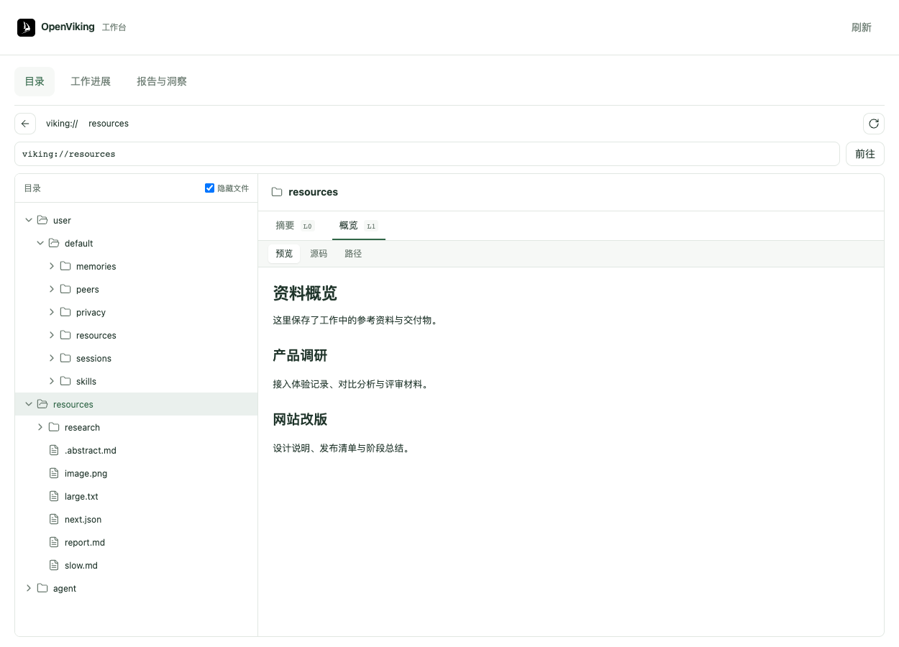
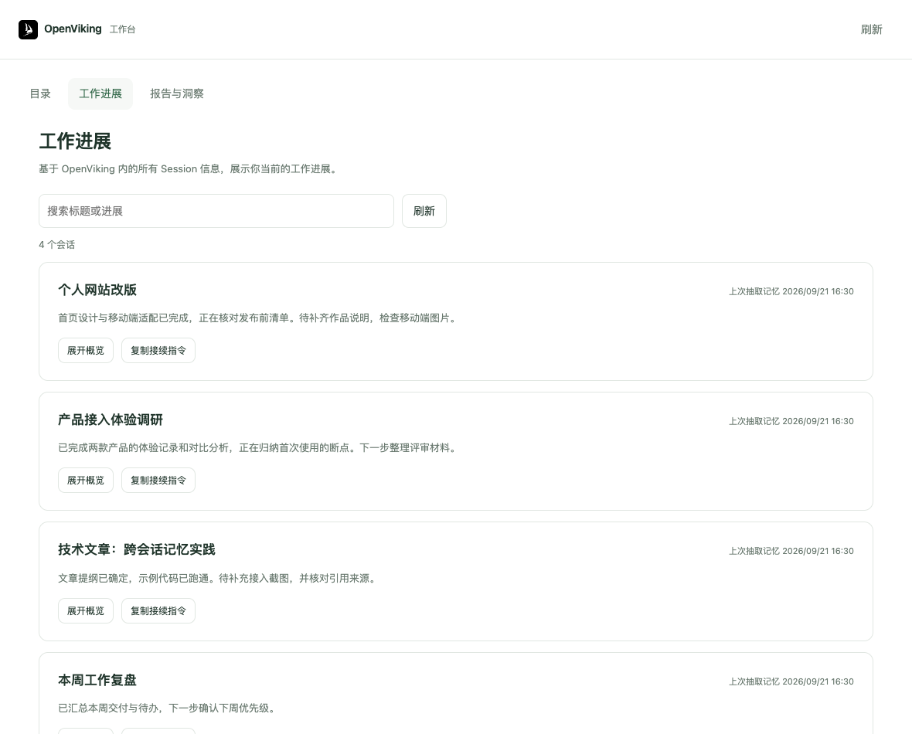
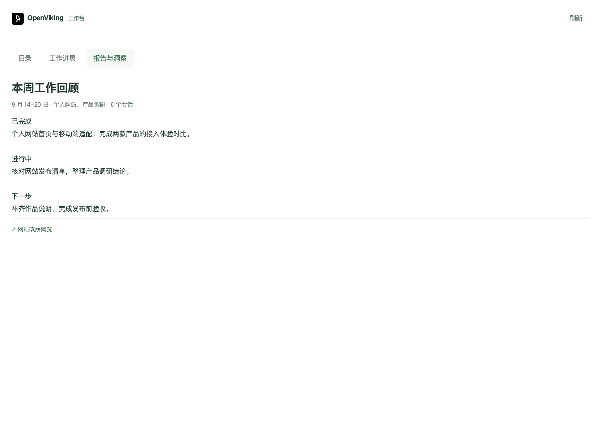

# OpenViking Codex App

让 Codex 记住已有背景，带上过去的工作，并在需要时回顾进展、查找资料、整理报告。

连接你的**火山 OpenViking 个人空间**，在对话中完成接入，日常在 Codex 右侧打开工作台。

- **带入已有工作**：按时间、项目或描述选择历史，确认清单后导入。
- **接着上次的进度**：查看云端会话的最新工作概览，回顾决定、待办和下一步。
- **随时查看与整理**：浏览目录和资料，让 Codex 按需生成日报、周报或知识洞察。

> 本页截图使用示例数据，由当前插件界面渲染。接入卡片截图来自模拟 MCP Apps 宿主，不代表 Codex 原生宿主验收；实际展示方式随宿主版本变化。

## 开始使用

准备好火山 OpenViking 个人版的 API Key，以及 Python 3.10+、Node.js 22+、Git、Codex CLI。当前已完成 macOS 安装验证，其他系统尚未完成真实安装验收。

**最方便的方式：**把 [安装指令](docs/install.md) 复制给 Codex，让它完成安装。也可以自己在终端执行：

```bash
git clone https://github.com/zhangxiaoyan1081/openviking-developer-codex-app.git
cd openviking-developer-codex-app
python3 install.py --companion-only
```

安装后**新开一个 Codex 任务**，发送：

```text
使用 openviking-codex-app 接入 OpenViking。
```

这个命令安装交互插件；后续接入流程会检查并按需安装官方 `openviking-memory`，分别验证连接与记忆能力。分发包包含打包后的界面，使用者无需执行 `npm install`。

如果你已从火山控制台复制了含 API Key 的接入指令，直接交给 Codex 即可，无需再次填写 Key。控制台集成见 [接入指令模板](docs/console-connect.md)。

## 第一次接入会经历什么

### 1. 连接你的 OpenViking

没有提供 API Key 时，先输入 Key；设备上已有连接时，选择使用当前连接或更换 Key。Codex 验证连接后继续，必要时引导你批准官方记忆插件的 Hook 或重新打开任务。


### 2. 确认今后如何协作

确认 Codex 何时参考记忆、保存哪些重要进展与交付物，以及如何说明信息的使用。你可以采用建议，也可以调整。

已有协作规则时，也会让你确认沿用或调整。新增规则在你确认后写入相应的 `AGENTS.md`，保留原有内容；沿用已有规则无需重写。


### 3. 选择是否带入过去的工作

可以选择**最近 7 天、1 个月、3 个月**的工作，选择一个或多个项目，或者用自己的话描述范围，例如：

> 带入最近一个月与个人网站改版有关的讨论和交付物。

Codex 先整理可读取的历史清单，说明覆盖范围与缺口，等你确认后再同步。也可以选择**从现在开始**，无需导入历史。


### 4. 查看同步进度，回顾已有工作

确认导入后，可以查看写入、读回核对与记忆整理的状态。云端抽取可能需要时间；已有可读取的概览或核对过的原始对话时，Codex 可以先帮你恢复工作背景。


随后查看工作摘要：做到哪里、有哪些决定、还缺什么、接下来可以怎么推进。点击**回顾这项工作**只总结进展并建议方向，等待你的下一条指令再执行任务。


选择不导入历史，也会说明当前协作状态，以及如何开始新工作或保存一份资料。接入中断后，可以在新任务中说：

```text
使用 openviking-codex-app 继续接入 OpenViking，从已保存的步骤继续。
```

支持 MCP Apps 的 Codex 桌面宿主可使用交互卡片；CLI 或不支持卡片的宿主通过选项和文字完成相同步骤。

## 日常工作台

在 Codex 中发送：

```text
打开我的 OpenViking 工作台。
```

工作台直接在 **Codex 右侧面板**打开，按「目录 → 工作进展 → 报告与洞察」排列。

### 目录：浏览你的云端资料

从 `viking://` 根目录浏览当前 Key 有权访问的目录，保留 `user/default/...` 等实际层级，优先展示 `user`，随后是 `resources`。

- 展开目录树，选择文件即可预览。
- 选择文件夹，查看 **L0 摘要**与 **L1 概览**。
- 在预览、源码和路径之间切换，支持 Markdown、JSON、文本及接口返回的图片等内容。

目录交互参考 OpenViking Web Studio，不包含 VikingBot 操作。



### 工作进展：看看每项工作做到哪里

基于 OpenViking 当前用户 `sessions/` 下的所有 Session，读取各会话**最新 archive 的 L1 概览**，展示云端已有的工作进展，不局限于这次接入导入的历史。

每张横向卡片包含 **Session Title、Current State、上次抽取记忆时间**；时间取自最新归档 L1 文件的更新时间。会话多时可搜索和分页，点击「展开概览」查看全文。尚无归档或读取失败的会话会保留状态提示。



想继续某项工作，点击**复制接续指令**并粘贴到 Codex。Codex 会读取对应概览，先总结进展、建议推进方向，等你决定下一步。

### 报告与洞察：按需要整理工作成果

在对话中告诉 Codex 你想看什么，例如：

```text
根据最近 7 天的工作生成周报，列出已完成、进行中、下一步和来源。
```

```text
回顾最近一个月的产品调研，整理反复出现的问题和可复用的经验，注明来源。
```

Codex 读取实际资料，说明时间范围与缺口，生成日报、周报、工作汇总或知识洞察。报告正文保存到个人 OpenViking 资源目录并读回核对后，可在工作台查看报告内容和来源。



报告按需生成；不会默认开启定时任务。侧边工作台用于浏览，生成新报告仍在对话中发出请求。

## 更新与分享

已安装的用户，在仓库目录执行：

```bash
git pull --ff-only
python3 install.py --companion-only
```

随后新开 Codex 任务加载新版。更新交互插件不会重新安装官方记忆插件；已有任务可能继续运行原版本。

仓库已公开，可以直接把**本 README 或 [安装指令](docs/install.md)** 分享给同事。每个人配置自己的火山 API Key。更多说明见 [团队试用](docs/team-quickstart.md) 和 [分发说明](docs/distribution.md)。

## 当前支持范围

- 面向火山 OpenViking **个人版**，复用官方 `openviking-memory`；不安装本地 OpenViking 服务端，不自动识别或分流企业版。
- 自动记忆取决于官方插件与 Hook 的实际启用状态；连接成功不等于所有记忆能力已验证。
- 历史导入以宿主工具可读取或用户提供的内容为准；不扫描宿主私有数据库，不采集 Computer History。附件原件是否同步会单独说明。
- 工作台服务运行在用户本机，使用已配置的公有云连接；远程 HTTPS MCP 服务尚未部署。改造思路见 [远程 MCP 方案](docs/remote-mcp.md)。

## 开发与验证

<details>
<summary>查看源码入口、验证命令与验收边界</summary>

| 模块 | 入口 |
| --- | --- |
| MCP Apps 工具与资源 | [src/server.mjs](src/server.mjs) |
| 对话卡片与工作台界面 | [src/ui.mjs](src/ui.mjs)、[src/panel.mjs](src/panel.mjs) |
| 云端目录浏览 | [src/explorer.mjs](src/explorer.mjs)、[目录说明](docs/workspace-browser.md) |
| 云端 Session 工作进展 | [src/progress.mjs](src/progress.mjs)、[工作进展说明](docs/session-progress.md) |
| 接入、同步与长期协作 | [插件技能](plugins/openviking-codex-app/skills/openviking-codex-app/SKILL.md)、[流程契约](plugins/openviking-codex-app/skills/openviking-codex-app/references/onboarding-flow.md) |
| 官方依赖固定版本 | [upstream.lock.json](upstream.lock.json) |

```bash
npm ci --ignore-scripts
npx playwright install chrome
npm test
# 安装后检查实际启动配置与宿主注册
npm run check:installed
npm run check:codex-host
```

`npm test` 覆盖 Python、stdio MCP、卡片消息桥、接入状态、目录预览与工作进展等回归；使用隔离的示例资料。模拟宿主测试和配置检查不等于 Codex 对话中的真实卡片验收，后者还需核对显示、点击回传与流程推进。详见 [验收记录](docs/card-acceptance.md)。

</details>

交互参考 [OpenViking Web Studio](https://github.com/volcengine/OpenViking/tree/main/web-studio) 与 [MCP Apps](https://modelcontextprotocol.io/extensions/apps/overview)。第三方依赖许可见插件内的 [THIRD_PARTY_NOTICES.txt](plugins/openviking-codex-app/THIRD_PARTY_NOTICES.txt)。本仓库尚未指定项目开源许可证，公开可访问不等于授予任意再分发许可。
