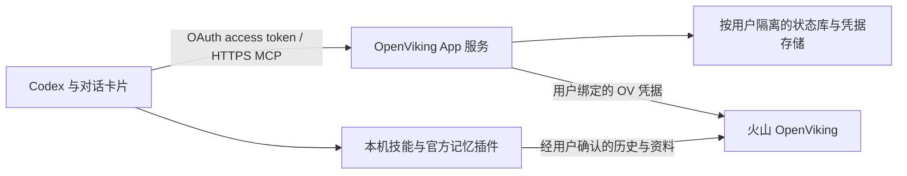

# OpenViking Codex App 远程 HTTPS MCP 改造方案

日期：2026-09-21
状态：基于当前代码的实施方案，远程服务尚未开发或部署。
代码基线：1342e33；图标、卡片和个人版 onboarding 已有本机实现。

## 目标与结论

远程 MCP 可以向 Codex 提供同样的工具和 MCP Apps 卡片；用户不必为了看工作台运行本地卡片服务。公网 GitHub 分发与远程 MCP 是两件独立的事：公开仓库后可以立即通过复制安装指令分发当前本机版，无需等待云端改造。官方目录的 MCP 提交目前要求稳定的公网 HTTPS 服务；将本机端口临时暴露并不等于可发布服务。

推荐保留“远程工作台 + 本机接入能力”的分工。历史读取、AGENTS.md 修改、官方 Hook 安装仍由用户电脑上的 Codex/技能执行，远程服务只接收用户授权范围内的内容和确认结果。

## 调用链

MCP 服务端的工具返回 ui:// 资源关联，resources/read 返回 HTML。卡片继续通过宿主消息桥调用工具；HTTPS MCP 不意味着必须让用户离开 Codex 打开普通网页。当前 src/ui.mjs 与 App SDK 代码可大体复用，但连接与本地操作入口需要调整。

## 现有代码如何拆分

| 当前实现 | 远程版本需要的变化 |
|---|---|
| src/server.mjs 使用 StdioServerTransport | 抽出共享工具注册函数，以 Streamable HTTP 接收 /mcp 请求，保留本机 stdio 入口兼容当前用户 |
| backend() 每次调用本机 Python 子进程 | 换为显式接收当前用户身份的服务模块；不再依赖单个服务器的 HOME |
| cloud.py 从 ~/.openviking/ovcli.conf 取 Key | 从经过认证的用户绑定读取加密凭据，每个请求单独构造 OV 客户端；禁止共享全局 Key |
| JSON 状态按本机 Key 哈希放在个人目录 | 数据库以 tenant_id、subject_id、connection_id 分区；flow_id/job_id 均须校验归属，不能靠持有 ID 就读写 |
| show_workspace / publish_work / publish_report / list_directory / read_file | 第一批远程化，保留现有 UI 与来源核对要求；权限由服务端身份决定，不能信任客户端传来的 user/default |
| review_import(path) | 改为接收受限、结构化的导入预览与内容摘要/hash；远程服务不能读取用户提供的本机路径 |
| prepare_collaboration(path, check_files) 与 apply_rules | 本机技能读写实际生效的规则，远端只显示行为摘要与确认记录。卡片点选和本机实际写入分开验证 |
| connect_existing / connect_key | 云端绑定单独设计；云端绑定不会更新用户电脑上的官方插件配置，也不能假装读到了用户电脑的旧连接 |
| history.py 的 apply/verify/status | 可先留在本机；向远端发布导入回执供卡片展示。若改为云端队列，客户端先提交明确授权的内容，需幂等键、核对、任务归属与可恢复状态 |
| open_workspace_panel 返回 127.0.0.1 URL | 云端工作台使用受认证的 HTTPS 页面，或继续用内嵌 App；不返回服务器自己的 localhost 给用户 |

不要直接在公网包装当前 app_backend.py：它依赖服务器本地凭据与文件路径，多用户使用会产生错误的身份、数据和文件操作边界。

## 实施顺序

1. **抽离服务逻辑。** 定义 UserContext 与 Storage/OVClient 接口；先用模拟身份完成两用户隔离测试，保留 stdio 兼容入口。
2. **实现 HTTP 入口。** 使用官方 MCP TypeScript SDK 的 Streamable HTTP transport；提供 /mcp、健康检查、资源读取与工具调用。入口挂在自有域名的 TLS 网关后，正确处理请求大小、超时、Origin 校验和流式响应。
3. **接入认证。** 对需要个人数据的工具校验 OAuth token 的签名、issuer、audience、期限与 scope；提供 protected-resource metadata 与授权服务器发现，支持授权码 + PKCE。优先复用成熟身份服务。
4. **绑定 OV。** 如果火山当前没有适用于该场景的 OAuth，用户登录 App 服务后，在自有绑定页填写 OV Key，后端加密保存并关联身份。App 的 access token 与 OV Key 是两个凭据，不能把收到的任意 bearer token 直接当作 OV Key 透传。是否有可直接复用的火山身份接口尚待确认。
5. **迁移状态与后台任务。** 将 onboarding、摘要、报告和同步回执放入用户隔离的持久存储；长耗时任务使用队列和 job 状态。记忆抽取状态仍以 OV 实际响应为准，提交成功不冒充完成。
6. **接上本机技能。** 本机收集来源、准备计划、修改 AGENTS.md 和安装官方 Hook；只在明确授权后发送选定数据。先发布远程工作台，后续再迁移导入，避免一次改动整个链路。
7. **部署与验收。** 构建容器，部署到火山的容器运行环境；配置域名、TLS、密钥管理和状态库。完成真实 HTTPS initialize→tools/list→tools/call→resources/read，OAuth 登录/失效/撤销、两个用户互不可见、重复提交、原生 Codex 卡片及本机配合流程的验收。
8. **申请公共目录。** 准备发布主体、支持/隐私页面、域名验证、可用测试账号和正反例，再提交审核。提供远程 URL 不等于自动通过审核。

示例域名形态：`https://<你控制的域名>/mcp`，这只是部署占位符，目前没有已上线地址。

## 首个版本建议

先交付远程“目录、工作摘要、报告”三项，以及身份/凭据绑定。批量历史与长期协作设置继续复用本机技能和官方插件。用户安装目录插件后可看云端资料；要导入本地历史、建立自动回流时，再按需要完成本机接入。

用户若仅通过远程 MCP 接入，不应承诺已安装官方 Hook、自动同步本机所有会话或能够修改其 AGENTS.md。不同宿主可获得的历史范围也需明确。

## 来源

- [OpenAI：构建 MCP 服务](https://developers.openai.com/plugins/build/mcp-server)：Streamable HTTP、稳定 HTTPS 服务与工具资源。
- [OpenAI：认证](https://developers.openai.com/plugins/build/auth)：OAuth 2.1、PKCE、元数据与令牌校验。
- [OpenAI：提交与发布](https://developers.openai.com/plugins/deploy/submission)：公网 MCP 条件与审核流程。
- 当前仓库 src/server.mjs、src/ui.mjs、scripts/app_backend.py、cloud.py、onboarding.py 与 history.py（后四者位于 plugins/openviking-codex-app/）。
